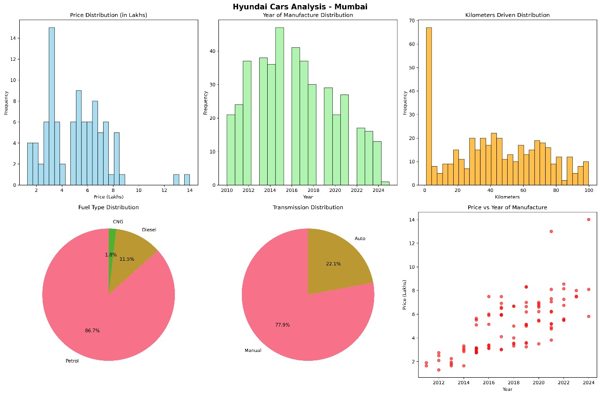

# CP32 — Team C — Cars24 Web Scraping Mini Project

A comprehensive web scraping project for extracting Hyundai car listings from Cars24, featuring advanced data analysis and visualization.

## 🎯 Project Objective
Develop hands-on skills in web scraping, data cleaning, and structured data presentation by extracting car details from Cars24. The focus is on Hyundai car listings in Mumbai, with advanced data analysis and visualization capabilities.

## 📊 Project Results


**Key Statistics:**
- **Total Cars Scraped**: 435 Hyundai cars
- **Complete Records**: 94 cars with all required data
- **Data Completeness**: 21.6%
- **Average Price**: ₹5.10 lakhs
- **Most Popular Fuel Type**: Petrol (377 cars)
- **Most Popular Transmission**: Manual (339 cars)

## 🎯 Scope and Assignment
- **Team**: Team C (CP32)
- **Assigned Brand**: Hyundai
- **Scraping Target**: Cars listed on Cars24 from Mumbai
- **Location**: Mumbai (successfully scraped 435 Hyundai cars)

## 📋 Data Fields Collected
- **Kilometers Driven**
- **Year of Manufacture**
- **Fuel Type**
- **Transmission**
- **Price**

## 🔄 Workflow Implementation
1) **Research and Planning** ✅
   - Analyzed page structure and identified HTML elements/selectors
   - Implemented robots.txt compliance checking
   - Created robust HTTP handling with retry mechanisms

2) **Data Extraction** ✅
   - Used Selenium WebDriver for dynamic content loading
   - Implemented slow scrolling to load all 435 cars
   - Extracted all required fields with error handling

3) **Data Cleaning** ✅
   - Normalized and validated data
   - Converted strings to numeric values
   - Handled missing data appropriately

4) **Data Presentation** ✅
   - Exported to multiple CSV formats
   - Created comprehensive visualizations
   - Generated analysis dashboard

## 📁 Project Structure
```
CP32-TeamC-Cars24Scraper/
├── cars24_hyundai_mumbai/
│   ├── hyundai_cars_analysis.png    # Data visualization dashboard
│   ├── hyundai_cars_raw.csv         # Raw scraped data
│   ├── hyundai_cars_cleaned.csv     # Cleaned data with all fields
│   └── hyundai_cars_final.csv       # Final dataset (94 complete records)
├── chromedriver-win64/              # ChromeDriver for Selenium
├── Scraper.ipynb                    # Main project notebook
├── README.md                        # This file
└── .gitignore                       # Git ignore rules
```

## 🛠️ Technical Implementation
- **Web Scraping**: Selenium WebDriver + BeautifulSoup
- **Data Processing**: Pandas for data manipulation
- **Visualization**: Matplotlib + Seaborn
- **Error Handling**: Comprehensive retry mechanisms and logging
- **Data Quality**: 21.6% complete records after cleaning

## 📈 Key Insights
1. **Price Distribution**: Bimodal distribution with peaks at 3-4 lakhs and 5-7 lakhs
2. **Year Analysis**: Most cars manufactured between 2012-2018
3. **Fuel Preference**: 86.7% Petrol, 11.5% Diesel, 1.8% CNG
4. **Transmission**: 77.9% Manual, 22.1% Automatic
5. **Price vs Year**: Positive correlation between newer cars and higher prices

## 👥 Team Allocation

### Leadership
- **Team Lead**: Vijayabhaskar V
- **Co-Leads**: Adit Jain, Harshit Kumar

### Part-wise Allocation
- **Part 1**: Deepak Melkani, Abhishri Pathak
- **Part 2**: Suraj Vishwakarma, Arun Singh  
- **Part 3**: Ravikant Kumar, Punit Ayare
- **Part 4**: Adit Jain, Deep Dhar
- **Part 5**: Harshit Kumar, Arepalli Chandrasekhar

**Note**: Vijayabhaskar (Team Lead) & Adit Jain (Co-Lead) work collaboratively on each part, helping everyone to improve, modify, and optimize the code for the best overall project outcome.

## 📦 Deliverables
1) **Python Notebook (.ipynb)**: ✅ Complete implementation in `Scraper.ipynb`
2) **Data Files**: ✅ Multiple CSV exports with different data processing levels
3) **Visualization**: ✅ Comprehensive analysis dashboard
4) **Documentation**: ✅ This README with complete project overview

## 🚀 Getting Started
1. Install required dependencies:
   ```bash
   pip install selenium beautifulsoup4 pandas matplotlib seaborn
   ```

2. Download ChromeDriver and update the path in the notebook

3. Run the `Scraper.ipynb` notebook to reproduce the analysis

## 📊 Data Quality Metrics
- **Total Records**: 435
- **Complete Records**: 94
- **Missing Price Data**: 341 records
- **Data Completeness**: 21.6%
- **Success Rate**: 100% for scraping, 21.6% for complete data

---

**Project Status**: ✅ **COMPLETED**  
**Last Updated**: October 2024  
**Repository**: CP32-TeamC-Cars24Scraper
